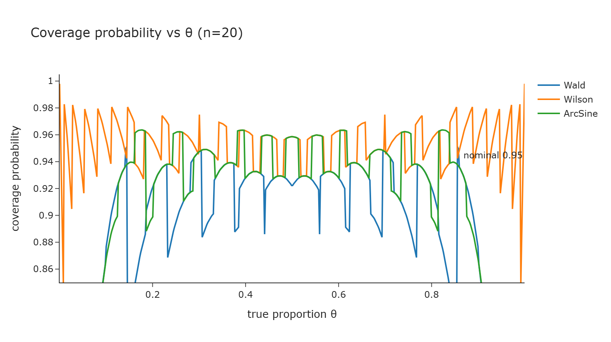
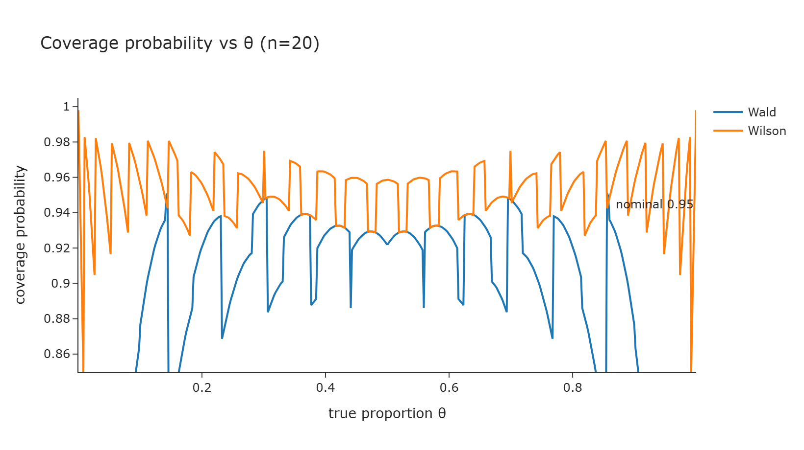
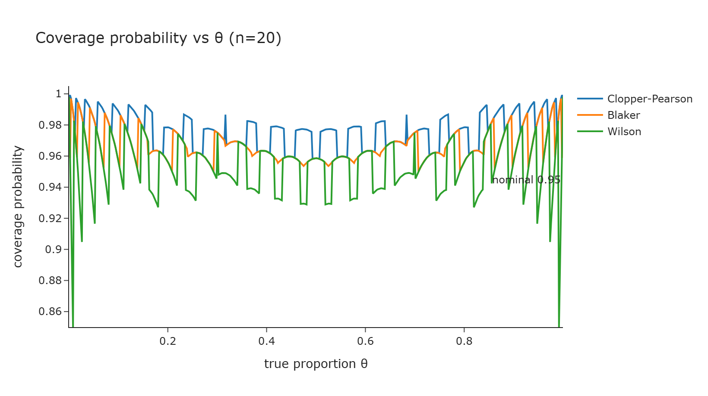
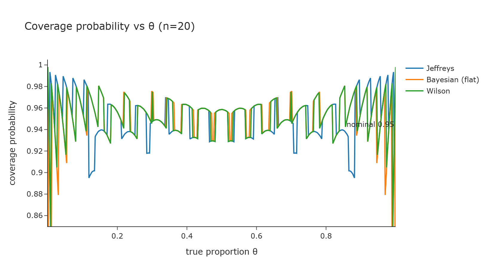

<div align="center">

<pre>
██████╗ ██╗███╗   ██╗ ██████╗ ███╗   ███╗ ██████╗██╗██╗  ██╗██╗████████╗
██╔══██╗██║████╗  ██║██╔═══██╗████╗ ████║██╔════╝██║██║ ██╔╝██║╚══██╔══╝
██████╔╝██║██╔██╗ ██║██║   ██║██╔████╔██║██║     ██║█████╔╝ ██║   ██║   
██╔══██╗██║██║╚██╗██║██║   ██║██║╚██╔╝██║██║     ██║██╔═██╗ ██║   ██║   
██████╔╝██║██║ ╚████║╚██████╔╝██║ ╚═╝ ██║╚██████╗██║██║  ██╗██║   ██║   
╚═════╝ ╚═╝╚═╝  ╚═══╝ ╚═════╝ ╚═╝     ╚═╝ ╚═════╝╚═╝╚═╝  ╚═╝╚═╝   ╚═╝   
</pre>

**Inference for a single binomial proportion**

<br/>

[](https://python.org)
[](https://pypi.org/project/binomcikit/)
[](tests/)
[](LICENSE.txt)

[](https://pranava-babinomcikit-rtd.readthedocs.io/en/latest/)

<br/>

*Twelve confidence-interval methods, a full evaluation suite, and a Bayesian toolbox — one engine, fully documented.*

</div>

<br/>

---

## What it is

`binomcikit` estimates a **single binomial proportion** — the true success rate θ behind *x* successes
in *n* trials (a coin's head-rate, a defect rate, a diagnostic test's sensitivity). It is a Python port
of the peer-reviewed R package [`proportion`](https://github.com/RajeswaranV/proportion), extended with
a new exact method (**Blaker**), a modern **access layer**, and documentation written for someone who
has never studied probability.

The novelty is not the intervals (many libraries have those) — it is the **evaluation suite** that
*scores* an interval (coverage, expected length, p-confidence/p-bias, error) and the **Bayesian
toolbox** (credible intervals, Bayes factors, empirical Bayes, posterior predictive), unified in one
package.

---

## Installation

<details open>
<summary><strong>🐍 From PyPI</strong></summary>
<br/>

```bash
pip install binomcikit                 # core (numpy, scipy, pandas)
pip install "binomcikit[plots]"        # + interactive Plotly figures
pip install "binomcikit[fast]"         # + optional numba acceleration for large n
```

</details>

<details>
<summary><strong>🔧 From source</strong></summary>
<br/>

Requires Python 3.9+.

```bash
git clone https://github.com/pranava-ba/binomcikit.git
cd binomcikit
pip install -e ".[dev]"
pytest -q
```

</details>

---

## Quick Start

| Step | Action |
|------|--------|
| 1 | `import binomcikit as bk` |
| 2 | One interval: `bk.ci(x=3, n=20)` — Wilson (Score) by default |
| 3 | Pick a method: `bk.ci(x=3, n=20, method="blaker")` (or `wald`, `jeffreys`, `exact`, …) |
| 4 | Compare them all for your data: `bk.compare(x=3, n=20)` |
| 5 | Let the package choose: `bk.recommend(n=20, by="length")` |
| 6 | Plot it: `bk.plot_coverage(n=20, methods=["wald", "wilson", "blaker"])` |

```python
import binomcikit as bk

bk.ci(x=3, n=20, method="wilson")      # the recommended default
bk.ci(n=20, method="blaker")           # exact, never wider than Clopper–Pearson
bk.posterior(3, 20)                     # full Beta posterior summary
bk.from_data([1, 0, 1, 1, 0])          # -> (3, 5), straight from raw 0/1 data
```

---

## Coverage, visualised

Every method is measured on the same engine. These are produced by `bk.plot_coverage(...)` — true
coverage vs. the unknown proportion θ (the dashed target is the nominal 95%):

<div align="center">

<table>
  <tr>
    <td><br/><sub><b>Wald</b> sags below nominal</sub></td>
    <td><br/><sub><b>Wilson</b> hugs the target</sub></td>
  </tr>
  <tr>
    <td><br/><sub><b>Blaker</b> (new) — guaranteed, but tighter than CP</sub></td>
    <td><br/><sub><b>Bayesian</b> credible intervals</sub></td>
  </tr>
</table>

</div>

---

## Methods

Twelve interval methods, each with a two-part documentation page (*Use it* / *Understand it*):

| Method | Idea | Back-transform / note |
|--------|------|-----------------------|
| **Wald** | normal approximation around p̂ | teaching baseline; under-covers at small *n* |
| **Wilson (Score)** | invert the score test | the recommended default |
| **Agresti–Coull** | adjusted Wald ("add 2 successes, 2 failures") | simple and reliable |
| **ArcSine** | variance-stabilising `arcsin√p̂` scale | back-transform `p = sin²(φ)` |
| **Logit-Wald** | Wald on the log-odds scale | `expit` back-transform; exact at x = 0, n |
| **Wald-T** | Student-*t* + Satterthwaite d.o.f. | small-sample correction (Pan 2002) |
| **Likelihood-ratio** | invert the LR test | coverage ≈ Wilson |
| **Clopper–Pearson** | exact, equal-tailed | guaranteed coverage ≥ 1−α |
| **Mid-P** | exact, half the point mass in the tail | less conservative than CP |
| **Blaker** ⭐ *new* | exact acceptability interval | ⊆ Clopper–Pearson, still guaranteed |
| **Bayesian** | Beta posterior credible interval | quantile + HPD |
| **Jeffreys** | Bayesian with Beta(½, ½) prior | excellent frequentist coverage |

Each also has adjusted (`h=`) and continuity-corrected (`c=`) variants where applicable, plus the four
metric families and the Bayesian toolbox.

---

## Features

<details>
<summary><strong>📏 Evaluation suite — score any interval</strong></summary>
<br/>

- **Coverage probability** (`covp*`) — how often the interval actually traps θ
- **Expected length** (`length*`) — average width
- **p-confidence / p-bias** (`pcopbi*`) — directional performance
- **Error & long-term power** (`err*`) — plus aberration / zero-width-interval flags

All share one vectorised engine (optional numba acceleration for large *n*).

</details>

<details>
<summary><strong>🎲 Bayesian toolbox</strong></summary>
<br/>

- Credible intervals (quantile + HPD), posterior summaries, named priors
- **Bayes factors** (six formulations, Jeffreys-scale interpretation)
- **Empirical Bayes** (prior estimated from the data)
- **Posterior probability** `P(θ < threshold)` and **posterior predictive** for future trials

</details>

<details>
<summary><strong>🧰 Access layer</strong></summary>
<br/>

- `from_data` / `from_counts` — build `(x, n)` from raw 0/1 data
- `point_estimate`, `posterior`, `prior` — estimates and posteriors
- `coverage_curve` / `length_curve` — the numbers behind the plots
- `compare` — every method side by side; `recommend` — the package picks for you

</details>

<details>
<summary><strong>📚 Documentation</strong></summary>
<br/>

A "probability-from-zero" Foundations track, a glossary that links **every** technical term, a two-core
page per method, a method-selection guide, and the Bayesian-toolbox tour —
[**read the docs**](https://pranava-babinomcikit-rtd.readthedocs.io/en/latest/).

</details>

---

## Credits

`binomcikit` is a Python port of the R package **[`proportion`](https://github.com/RajeswaranV/proportion)**
by **M. Subbiah** and **V. Rajeswaran** (Subbiah & Rajeswaran, *SoftwareX* 6, 2017); the statistical
methods and their organisation originate there. This port adds the Blaker interval, the access layer,
and the documentation.

---

<div align="center">

**binomcikit** · a Python port of R `proportion` · © 2024–2026

</div>
