# Gallery

Every numeric function in `binomcikit` has a plotting counterpart (add the
`plot` prefix). Each returns a [plotnine](https://plotnine.org) `ggplot` you can
display, save, or add layers to. A selection is shown below; the code above each
image reproduces it.

## Confidence intervals

```python
bk.plotciall(20, 0.05)
```
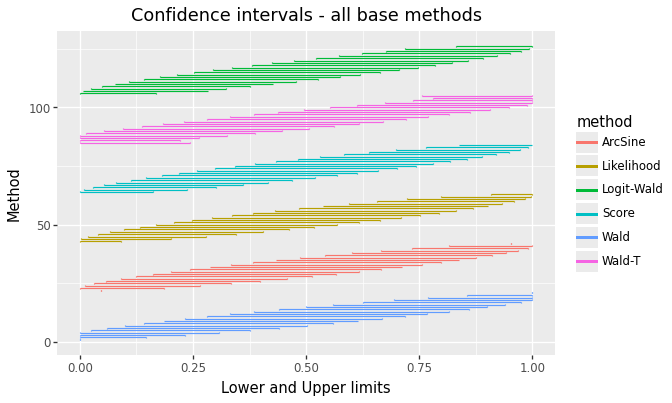

```python
bk.plotciallg(20, 0.05)
```
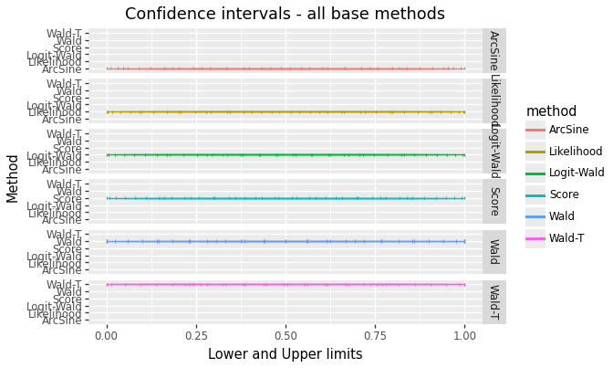

```python
bk.plotciwd(20, 0.05)
```
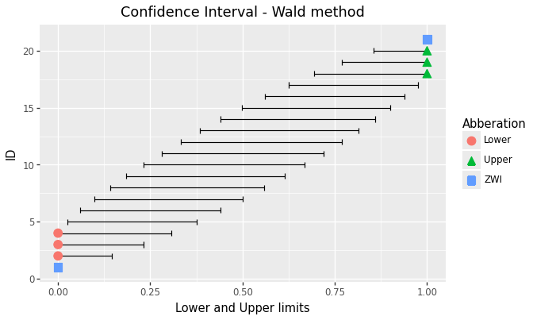

```python
bk.plotciallx(7, 20, 0.05)
```
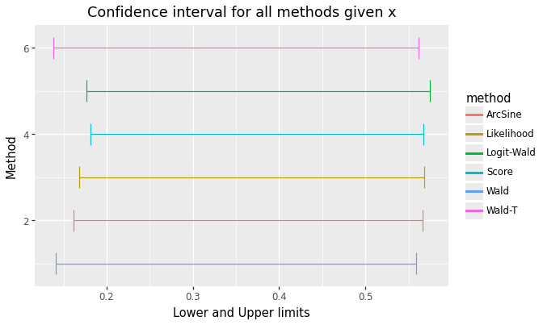

```python
bk.plotciba(20, 0.05, a=1, b=1)
```
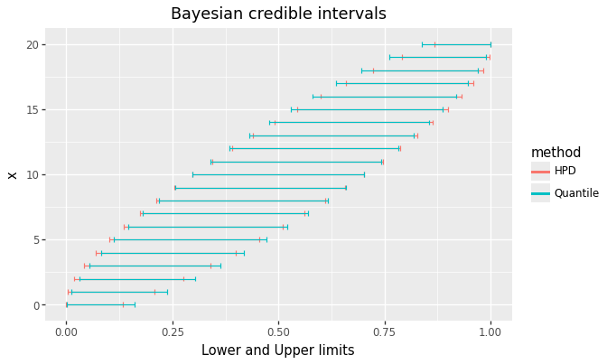

## Coverage probability

```python
bk.plotcovpall(15, 0.05, a=1, b=1, t1=0.9, t2=0.97, seed=0)
```
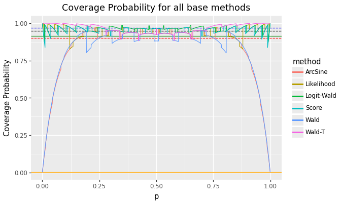

```python
bk.plotcovpwd(15, 0.05, a=1, b=1, t1=0.9, t2=0.97, seed=0)
```
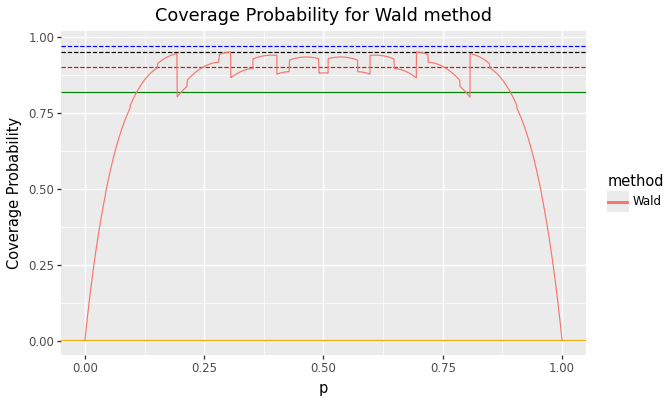

```python
bk.plotcovpba(15, 0.05, a=1, b=1, t1=0.9, t2=0.97, a1=0.5, a2=0.5, seed=0)
```
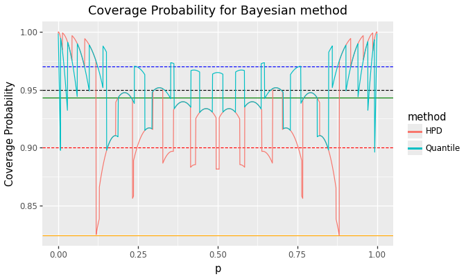

## Expected length

```python
bk.plotexplall(15, 0.05, a=1, b=1, seed=0)
```
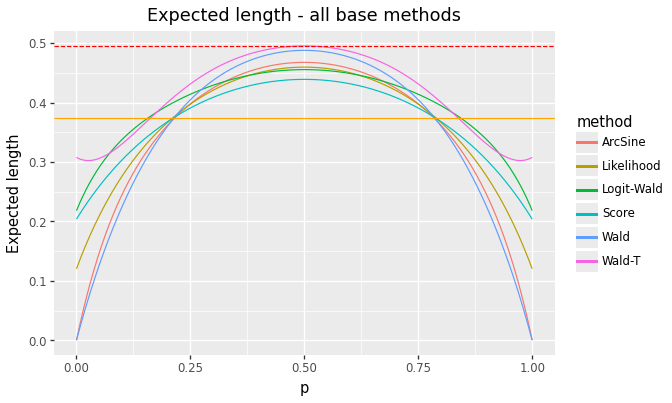

```python
bk.plotlengthall(15, 0.05, a=1, b=1, seed=0)
```
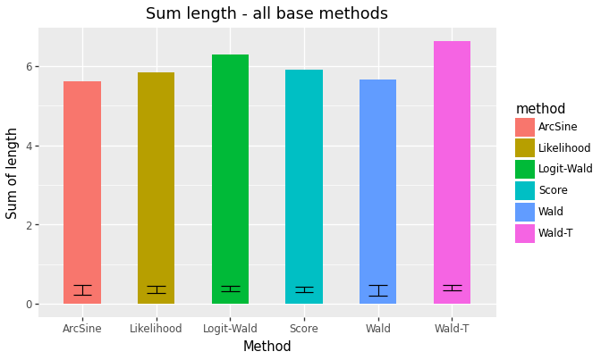

## p-confidence & p-bias

```python
bk.plotpcopbiall(20, 0.05)
```
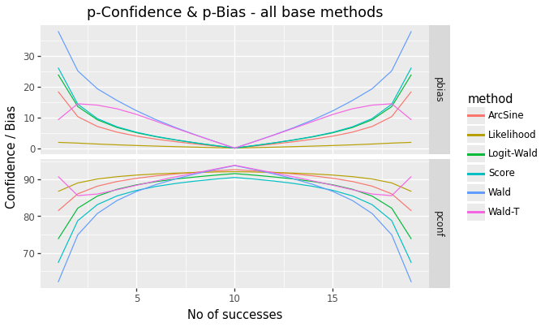

## Error & long-term power

```python
bk.ploterrall(20, 0.05, phi=0.5, f=-2)
```
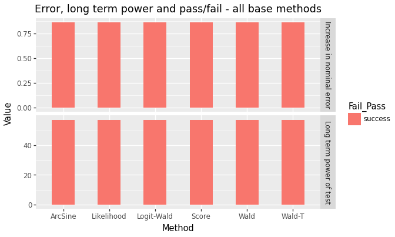

---

*Gallery images are produced by `tools/render_gallery.py`.*
